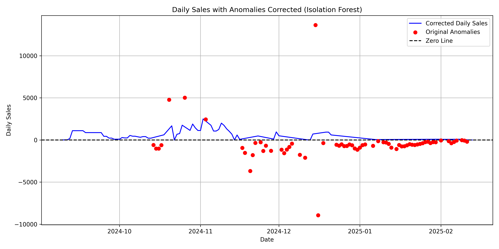

# Sales Anomaly Correction

The provided a Python script (`correct_sales.py`) designed to compute daily sales/deltas from cumulative total sales data, detect and treat anomalies/outliers, and handle missing data. It uses a combination of gap-filling techniques and the Isolation Forest algorithm to clean and correct sales data, ensuring sensible daily sales values.

## Overview

The tool takes a CSV file with "Total Sales" and "Date" columns as input, processes it to derive daily sales (deltas), fills missing days, identifies and corrects anomalies (including negative deltas and extreme spikes), and outputs a corrected CSV file along with a visualization.



## User Requirements

Based on the requirements analysis, the algorithm fulfills the following needs:

1. **Daily Delta Calculation and Outlier Treatment**:
   - Computes daily sales (deltas) from cumulative total sales.
   - Identifies and treats outliers, such as sudden massive spikes or reductions.

2. **Handling Data Issues**:
   - Addresses missing data by filling gaps with assumed values.
   - Detects anomalies/deviations (e.g., negative deltas or unrealistic spikes).

3. **Generic Cleaning Algorithm**:
   - Cleans data by filling missing dates and correcting anomalies.
   - Assumes missing daily sales based on surrounding data.
   - Applies proper treatment to anomalies using machine learning (Isolation Forest).

4. **Total Sales Constraints**:
   - Guarantees total sales always increase or remain stagnant (no reductions).
   - Treats reductions or massive spikes as potential outliers.

## Development Process

Here’s a step-by-step outline of how the algorithm was created:

1. **Requirement Gathering**:
   - Identified the need to compute daily sales from total sales, handle missing data, and treat anomalies.
   - Defined constraints: daily sales as integers, no negative deltas, sensible values.

2. **Initial Data Processing**:
   - Designed a method to load a CSV with "Total Sales" and "Date" columns.
   - Computed initial daily sales on total sales.

3. **Handling Missing Data**:
   - Expanded the dataset to include all dates.
   - Filled gaps by averaging the total delta over missing days (e.g., 9/12 to 9/17: 5715 - 200 = 5515 over 5 days = 1103/day).

4. **Anomaly Detection Exploration**:
   - Uses Isolation Forest (machine learning) for contextual anomaly detection, adding features like lag and rolling mean.

5. **Anomaly Treatment**:
   - Replaced anomalies (negatives and spikes) with interpolated values using linear interpolation.
   - Ensured no negative daily sales by explicitly flagging and correcting them.

6. **Refinement**:
   - Added a "Notes" column to distinguish "Delta" (original deltas) from "Assumed" (gap-filled or corrected values).
   - Fixed edge cases (e.g., NaN errors) by filling post-interpolation NaNs with 0.

7. **User Flexibility**:
   - Allowed users to specify Isolation Forest `contamination` (0.01–0.5 or "auto").
   - Ensured output includes a corrected CSV and a visualization.

8. **Final Algorithm**:
   - Combined all steps into a robust script: load data, fill gaps, detect anomalies, correct them, and save outputs.

## Installation
```bash
pip install pandas numpy matplotlib scikit-learn
```

## Usage

1. **Prepare your input CSV**:
    - Format: Two columns: "Total Sales" (cumulative sales) and "Date" (MM/DD/YYYY).
    - Example:

    ```
    Total Sales,Date
    0,9/9/2024
    27,9/11/2024
    200,9/12/2024
    5715,9/17/2024
    ```

2. **Run teh script**:
    ```
    python correct_sales.py
    ```

3. **Follow prompts**:
    - Enter CSV file path.
    - Enter teh contamination value (e.g. `0.1` for 10% anomalies, or `auto`)